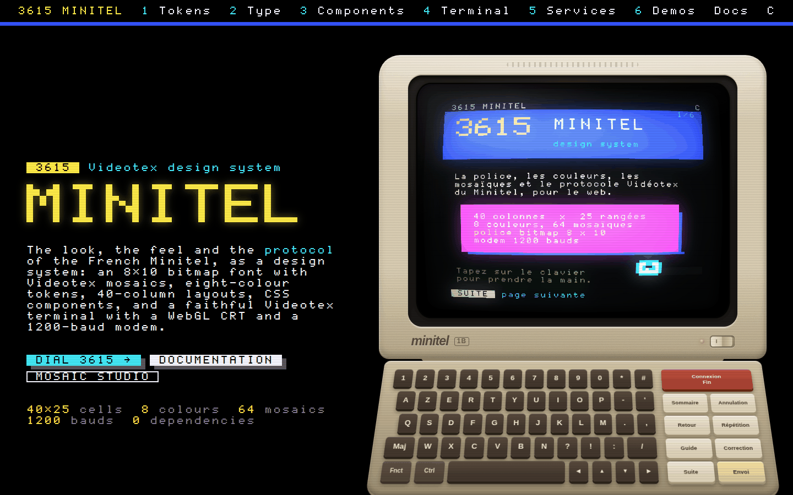
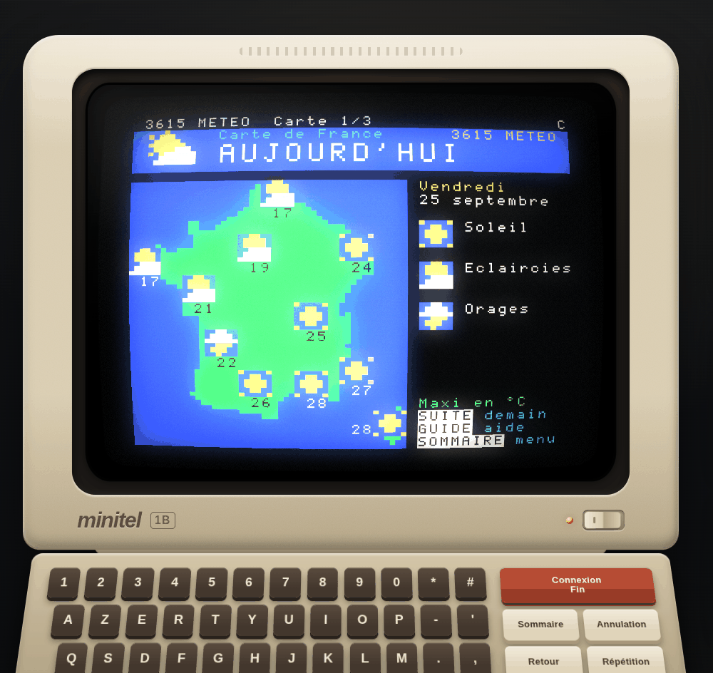
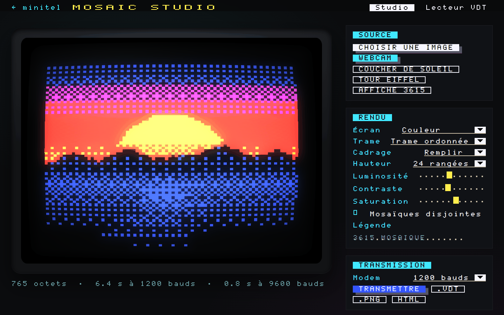
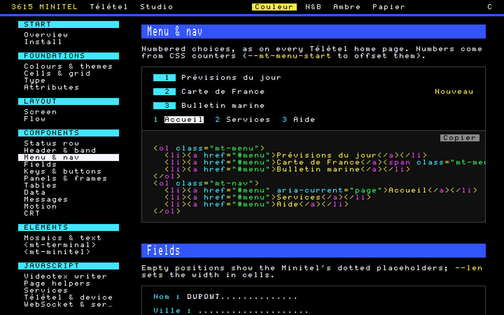
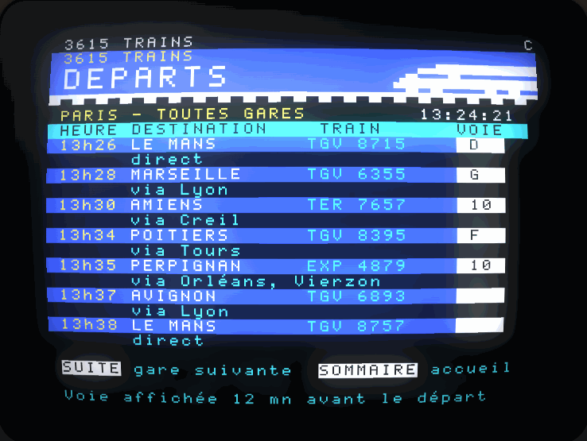
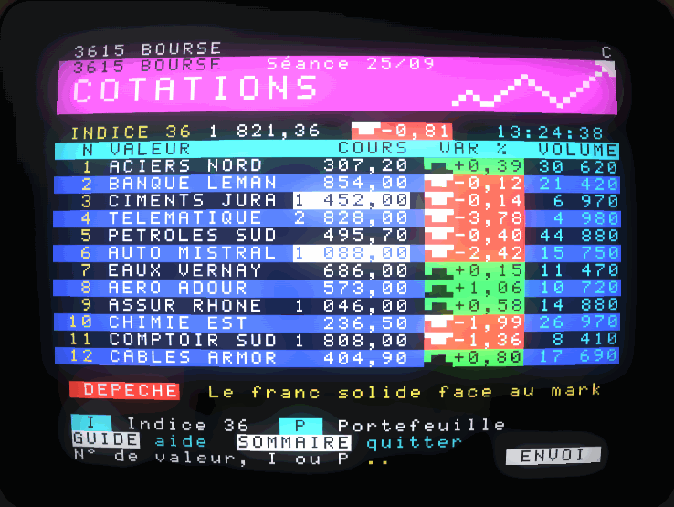
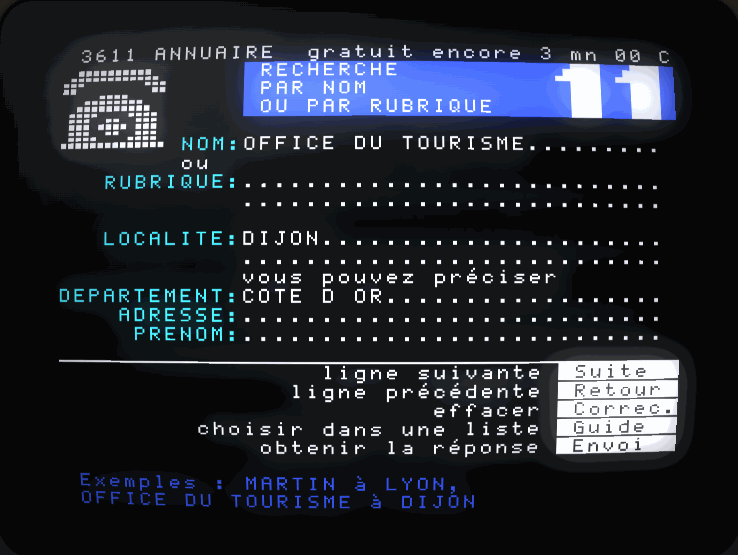
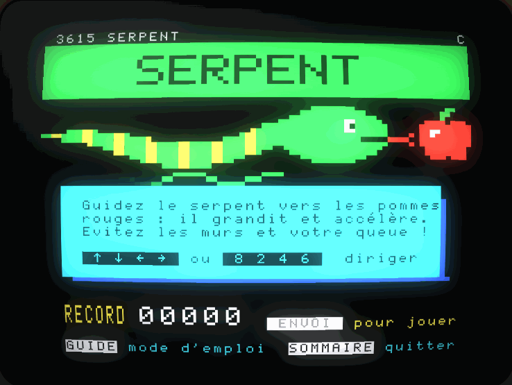
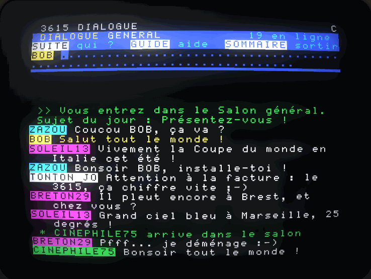
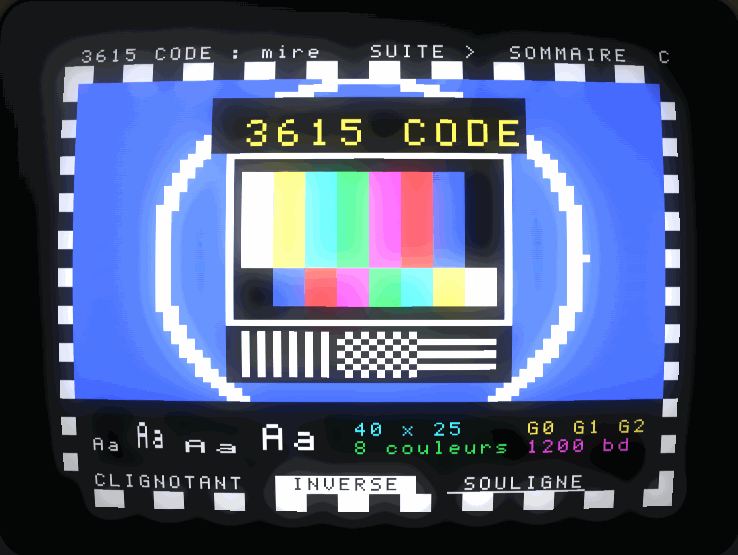

# minitel

**The French Minitel as a design system.** An 8×10 bitmap font with Videotex mosaics, eight-colour tokens, 40-column layouts, CSS components, and a faithful Videotex terminal with a WebGL CRT and a 1200-baud modem. No dependency, no build step.



- **Demo site:** open `index.html` through any static server (`npm run dev`), or publish the repository with GitHub Pages.
- **Télétel simulator:** [`demos/teletel/`](demos/teletel/) — dial 3615, hear the modem, type the service code.
- **Mosaic Studio:** [`demos/studio/`](demos/studio/) — pictures and live webcam to Videotex mosaics, `.vdt` player.
- **Documentation:** [`docs/`](docs/) — every component with its markup, custom elements, JavaScript API.

| 3615 METEO in the Télétel simulator | Mosaic Studio | Documentation |
| --- | --- | --- |
|  |  |  |

## What's inside

| Layer | Files | What you get |
| --- | --- | --- |
| Font | `src/fonts/`, `src/js/font/glyphs.js` | An original 8×10 pixel font (ASCII, French accents, Videotex G2 symbols, the 64 sextants of Unicode *Symbols for Legacy Computing*) as WOFF2/TTF, in normal, double-width and double-height faces, plus separated mosaics. |
| CSS kit | `src/css/` | Tokens and five themes (colour, mono, amber, green, paper), a cell grid, a fixed 40×25 page with Videotex-style placement, and ~30 components: status row, headers, bands, numbered menus, dotted fields, key caps, panels with mosaic shadows, frames, timetables, leaders, progress, charts, tickers, CRT effect. |
| Custom elements | `src/js/elements/` | `<mt-terminal>`, `<mt-minitel>` (the whole device, Minitel 1B or 2), `<mt-keyboard>`, `<mt-bigtext>`, `<mt-mosaic>`, `<mt-typewriter>`. |
| Videotex engine | `src/js/videotex/`, `src/js/terminal/` | A stream writer, a STUM1B decoder (serial attributes, G0/G1/G2, REP, US, row 0, CSI, PRO1-3), a native 320×250 renderer and a WebGL2 CRT (curvature, scanlines, bloom, phosphor persistence, power on/off). |
| Services | `src/js/service/`, `src/js/minitel.js` | Write Télétel services as async functions: sessions with server-side echo, fields, forms and function keys, a page toolkit, a 3615 kiosk, dialing, modem sounds and a bill in francs. Run them in the page, on a real Minitel over Web Serial, or connect the terminal to a WebSocket server. |

## Quick start

```html
<link rel="stylesheet" href="src/css/minitel.css">
<script type="module" src="src/js/elements/index.js"></script>

<body class="mt" data-mt-theme="color">
  <header class="mt-header">
    <span class="mt-header__code">3615 HELLO</span>
    <h1 class="mt-header__title">Bonjour</h1>
  </header>

  <ol class="mt-menu">
    <li><a href="#">Prévisions</a></li>
    <li><a href="#">Carte de France</a><span class="mt-menu__hint">Nouveau</span></li>
  </ol>

  <label class="mt-field"><span class="mt-field__label">Nom</span><input class="mt-input" style="--len: 20"></label>
  <kbd class="mt-key">Envoi</kbd>
</body>
```

Everything is in cascade layers (`mt.*`), so your own CSS always wins. Themes switch with `data-mt-theme` on any element.

### A Videotex page, byte for byte

```js
import { Page } from './src/js/index.js';

const page = new Page()
  .clear()
  .header({ title: 'Météo', code: 'METEO' })
  .menu(["Aujourd'hui", 'Demain', 'Carte de France'], { row: 7 })
  .bigText(16, 24, '19°', { color: 'green' })
  .prompt();

page.bytes();                                   // exact bytes for a real Minitel
document.querySelector('mt-terminal').write(page); // watch it arrive at 1200 bauds
```

### A Télétel service

```js
export default {
  code: 'HELLO',
  async run(session) {
    session.write(new Page().clear().header({ title: 'Bonjour' }).print(10, 3, 'Nom :'));
    const { key, value } = await session.input({ row: 10, col: 9, length: 20 });
    if (key === 'ENVOI') session.write(new Page().print(14, 3, `Salut ${value}`, { size: 'double' }));
  },
};
```

```js
const device = document.querySelector('mt-minitel');
device.network = new Teletel({ services: [hello] });
await device.powerOn();
await device.dial('3615', { code: 'HELLO' });
```

## The demo network

| 3615 TRAINS | 3615 BOURSE | 3611 |
| --- | --- | --- |
|  |  |  |
| **3615 SERPENT** | **3615 DIALOGUE** | **3615 CODE** |
|  |  |  |

| Number / code | Service |
| --- | --- |
| 3615 METEO | Weather with a mosaic map of France |
| 3615 TRAINS | Timetables over 75 stations, route diagrams, bookings and a live departures board |
| 3611 | The electronic directory and its famous search page: people, trades and offices by town or department, free for three minutes |
| 3615 BOURSE | Live quotes redrawn character by character, charts, orders and a portfolio |
| 3615 SERPENT | Snake at sextant resolution |
| 3615 DIALOGUE | Chat rooms of 1990, with regulars who answer back |
| 3615 ASTRO | Horoscope |
| 3615 CODE | The test card, character sets and mosaics: the design system inside the Minitel |
| 3615 MINITEL | The attract mode of the landing page |

Deep links open a service directly: `demos/teletel/?code=TRAINS`, `?number=3611`, with `&autostart&fast` to skip the power button and the modem.

## Videotex in one paragraph

A Minitel page is 24 rows of 40 cells plus a status row. Each cell holds one character of the alphanumeric set (G0, with accents through G2) or one of 64 mosaic characters (G1, a 2×3 grid of blocks). Foreground colour, flash, size and inversion are set per character; **background, underline and conceal are zone attributes** that only take effect at the next space (or mosaic character) and last to the end of the row — the source of most Minitel design quirks, and why `Page` helpers write delimiters for you. At 1200 bauds the modem delivers 120 characters per second, so a full page paints itself line by line in a few seconds: the terminal reproduces that pace.

## Development

```sh
npm run dev         # static server on http://localhost:3615
npm test            # decoder, writer, session and mosaic tests (node --test)
npm run build:font  # regenerate the web fonts from src/js/font/glyphs.js
```

The font is drawn as ASCII art in `src/js/font/glyphs.js`; `tools/build-font.mjs` traces it into TrueType outlines and packs WOFF2 with Node's Brotli, without dependencies.

## Credits

A tribute to the Minitel (1982–2012). The font, components and emulator are original work; the protocol follows the *Spécifications Techniques d'Utilisation du Minitel* (STUM1B). No ROM, archive page or trademark artwork is included.

## License

[MIT](LICENSE), fonts included.
